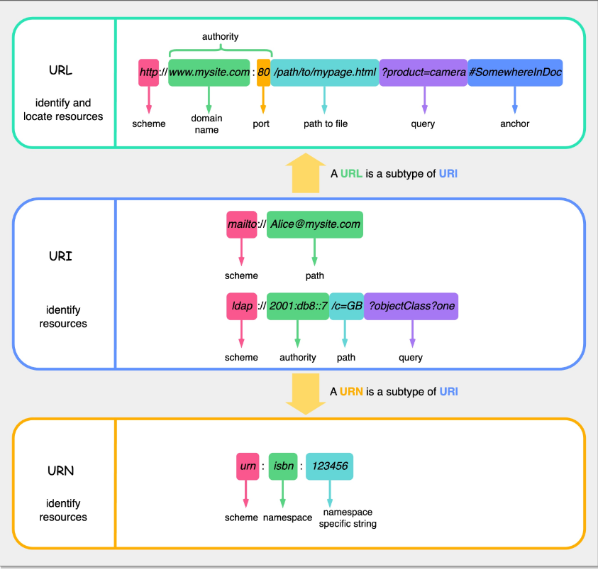
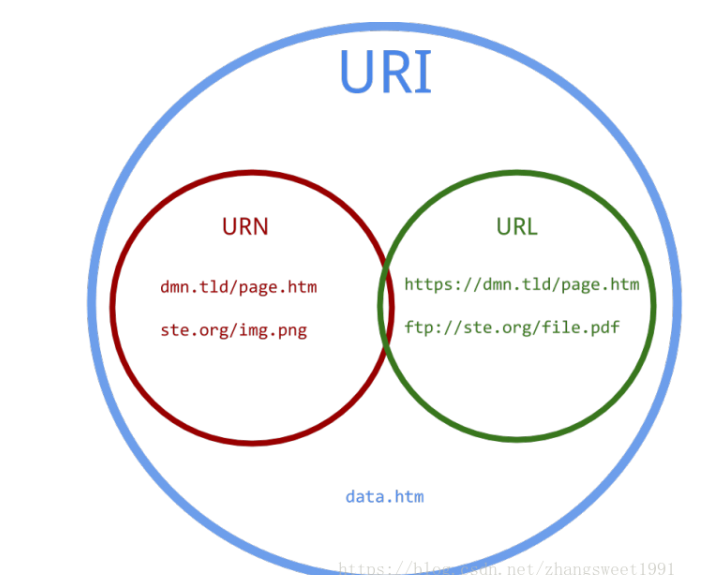
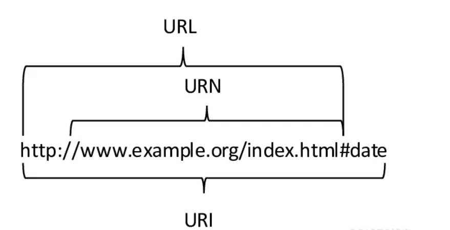

# 基础篇

## 一 入门知识

### 1.1 概述

###### Nginx是什么

Nginx是一个用C语言写的高性能、高并发的==HTTP服务器==

###### Nginx作用简述

* 反向代理
* 负载均衡
* 配置SSL证书
* 防盗链
* 解决跨域问题
* 缓存
* 限流
* 动静资源分离

###### 负载均衡软件

* LVS
* Nginx
* HAProxy

### 1.2 HTTP

###### URL URI URN的关系

* URI（Uniform Resource Identifier）是一个用于标识某一资源的字符串，它是一个抽象的术语，分为两个具体的子集URL和URN。URI提供了一种在互联网上唯一标识资源的方法
* URL：定位资源的路径 URL（Uniform Resource Locator）是URI的一种，它不仅标识了资源，还提供了如何定位该资源的方法。URL由多个部分组成，包括协议（http、https等）、主机名、端口号、路径。它是我们在浏览器地址栏中常见的形式，如："https://www.example.com/page"。URI 不提供定位所述资源的方法
* URN：命名资源的独特标识 URN（Uniform Resource Name）也是URI的一种，它是一种资源的独特命名方式，与资源的位置无关。URN的一个典型例子是ISBN（国际标准书号），通过URN可以唯一标识一本书，而不考虑这本书存储在哪里

###### HTTP请求报文

1. 请求行

* 请求方法
* 请求URL
* 请求方法
* HTTP版本

2. 请求头：客户端向服务器传递请求时附加的一些信息，由 key/value 组成
3. 请求空行：
4. 请求体：一般由POST请求方法进行提交，可能是图片、文件或字符串

###### HTTP响应报文

1. 响应行

* HTTP版本号
* 状态码
* 状态码描述

2. 响应头：为响应报文附加的额外信息。常见的响应头key有Content-Type和 Content-Encoding
3. 响应体：指请求返回到客户端的正文数据

### 1.3 线程模型

### 1.4 惊群效应

## 二 安装配置

### 2.1 单机安装

### 2.2 Keepalive

## 三 核心功能

### 正向代理

### 方向代理

### 负载均衡

### 动静分离

### 其他

#### 限流

#### 重写或重定向

## 三 HTTPS

隧道式代理 lvs DR

* 反向代理
* 动静分离 
* URLRewrite
* 负载均衡

iphash

* 效率高,但容易造成流量倾斜
* ip集中
* 后端服务器宕机,session不可用
* 中小型项目,快速空扩容

request_uri

* 不支持cookie的情况下,将jsessionid拼接在请求路径上
* 服务器资源存在倾斜

# 中级篇

### keepalived

## 第三方模块

sticky模块 

扩容

* 单机垂直拓容:硬件资源增加
* 水平拓展:集群化
* 细粒度拆分:分布式
  * 数据分区
  * 上游服务SOA化(原生支撑水平/垂直扩容)
  * 入口细分
    * 浏览器
    * 移动端原生APP(物联网)
    * H5内嵌式应用
* 数据异构化

### Keepalive

## 性能调优

* 参数调优
* gzip压缩
* Brotli压缩
* Concat 

### 资源静态化 

* SSI
* Rsync
* inotify

### 多级缓存

* 静态资源缓存
* 浏览器缓存
  * 内存缓存
  * 硬盘缓存
* CDN缓存
  * 
* 正向代理缓存
  * 
* 反向代理缓存
* Nginx内存缓存
* 外置内存缓存
* 上游服务器应用缓存

### GEOIP  

trace  

### 限流

### 日志

### Lua脚本

# 高级篇

 

## Openresty

## 高可用集群

## Nginx监控

 

